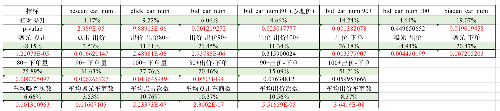
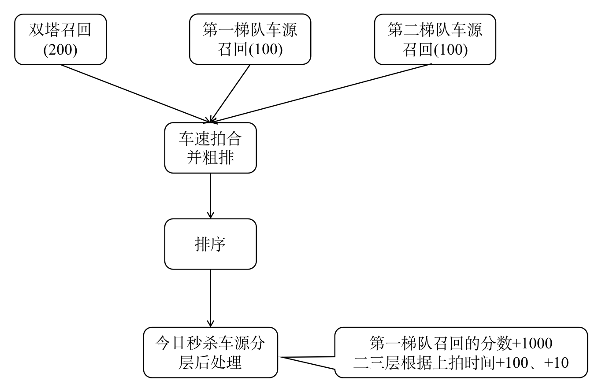
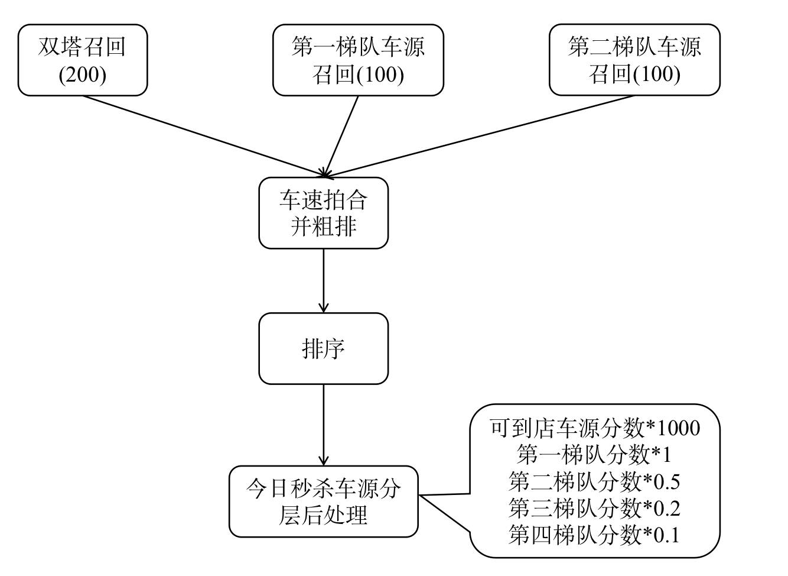
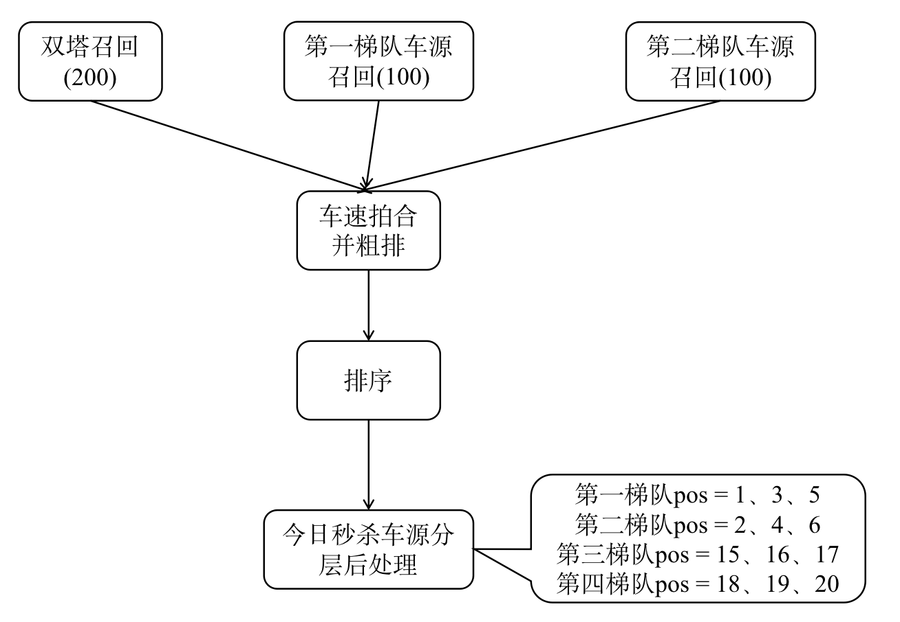
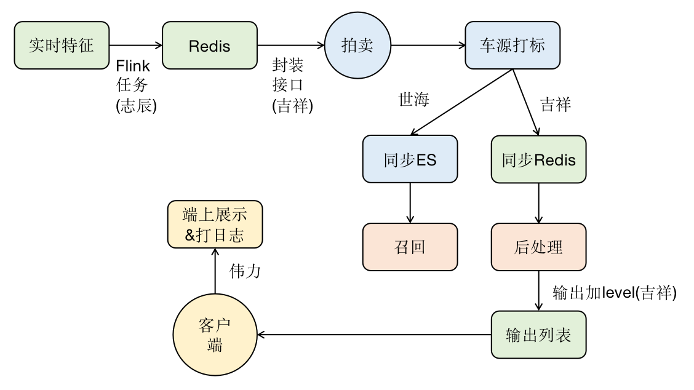

# 【2023-02-14】今日秒杀车源分层曝光
## 背景
- 问题：当前秒杀场曝光资源分配比较均匀，无法针对秒杀车源做到集中曝光，快速出价
- 目标：在高转化率阶段（上架7日内，车主有降价/邀约/7日成交等行为），进行集中曝光，提高出价充分度

## 结论
- 核心指标下单车源数实验组相对提升18.64%(38.1 -> 45.2, 显著)，预计转全后每日增加14单
- 实验组出价pv相对提升3.70%，每日车均出价车商数相对提升8.37%，均显著
- 实验组到心理价90%pv相对提升20.81%，每日车均点击车商数相对提升10.34%，其他佐证指标也没有明显负向，实验符合转全条件，2023-03-28转全

## 车源分层差异化曝光
| 车源分层  | 车源选取 | 车源排序|	
|:---:|:---:|:---:|
| 第一梯队车源 | 1、当日进入秒杀，且在暗拍阶段出价不充分车源；2、当日秒杀场车主降价车源；3、车主标记7日内交车车源；4、车主邀约车源； | 分组排序第一 |
| 第二梯队车源|  秒杀上拍7天内的车源；  | 分组排序第二|
| 第三梯队车源 | 秒杀上拍8～21天内的车源； | 分组排序第三|
| 第四梯队车源 | 其他车源； | 分组排序第四|

## 数据概览
|   | 第一梯队车源 | 第二梯队车源 |	第三梯队车源 | 第四梯队车源 | 总和 |
|:---:|:---:|:---:|:---:|:---:|:---:|
| 在售 | 1380(5.7%) | 6121(25.2%) | 7158(29.5%) | 11021(45.4%) | 24300(6121+7158+11021) |
| 双塔召回占比|  14213(9.6%)  | 42658(28.8%) | 40780(27.5%) | 59350(40.1%) | 148039(抽样1000次请求) |

## 优化过程

| 日期  | 动作 | 结论|
|:---:|:---:|:---:|
| 2023-03-02 | base版本策略，提权系数：{到店车：1000，第一梯队：1.0，第二梯队：0.5，第三梯队：0.2，第四梯队：0.1，非法梯队：0.001} | 结论：资源主要向第一梯队车源倾斜，整体点击、出价、下单pv下降 |
| 2023-03-07|  减弱提权系数区分度，提权系数：{到店车：1000，第一梯队：1.0，第二梯队：0.9，第三梯队：0.7，第四梯队：0.5，非法梯队：0.001}  | 结论：对第二、三、四梯队车源打压减弱后，整体点击、出价、下单pv上升|
| 2023-03-15 | 第一梯队车源有效期48h -> 24h，下掉了确定性专场 | 结论：计划观察到2023-03-25转全|

一些无提升的尝试：
- 将实验组第三、第四梯队中降价车源和车主邀约车源上升到第一梯队并与对照组对比优劣
- 将第三、四梯队车源中的降价车源、邀约车源挪到第一梯队 → 现改为挪到第二梯队
- 将秒杀第二梯度内【车主意向强且转化率高】的车，补充到秒杀第一梯度中

## 方案设计
### 方案一(油水分离)

### 方案二(调权重)
最终选用方案二(通过设置极限权重达到类似方案一的效果)

### 方案三(页内分层)

## 进度

- 2023-02-22：开始开发召回、后处理组件

- 2023-02-27：组件开发完毕、21分组新增车源曝光等级特征-c2b_exposure_level

- 预计2023-02-28提测

- 2023-03-01：preview环境测试完毕，晚上9.正式上线(c2b_today_seckill(B组)和c2b_seckill_chosen两个场景)

## 总结复盘
- 1.提权潜在风险：可能对车商产生重复曝光；可以尝试在排序模型中加入曝光相关特征(ratio/cnt/rate)让模型学出抵制重复曝光

- 2.组件开发时想过把第一梯队召回/第二梯队召回写成同一组件，召回梯度作为参数配置。但是由于同一场景策略下相同的两个组件(参数不同)log区分不开，影响后续数据分析，故就此作罢。今后可以对同场景策略的不同组件块分配id区分，这样可以无限复用一个filter_recall组件，将filter的内容作为配置参数，从而大大提高各种业务需求的召回组件开发效率

- 3.虽说重复曝光看起来可能不是好事，但从这个实验的第二阶段与第三阶段的对比可以感觉出，曝光次数这个特征不是线性特征，可能曝光三次以内用户没啥感觉，曝光567次被洗脑了就点进去看看，到了曝光10+次了又觉得烦不可能再点了，可以统计一下曝光次数与出价率的关系
