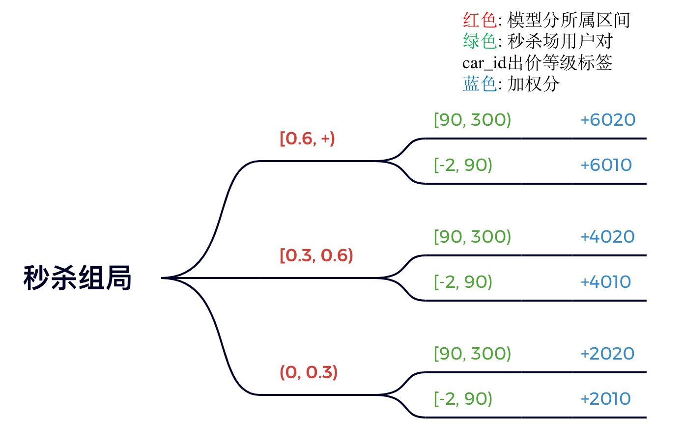
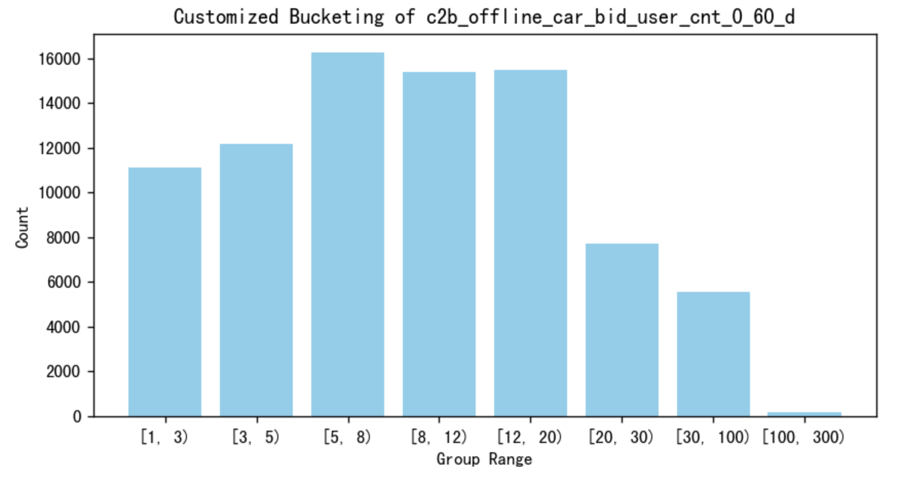
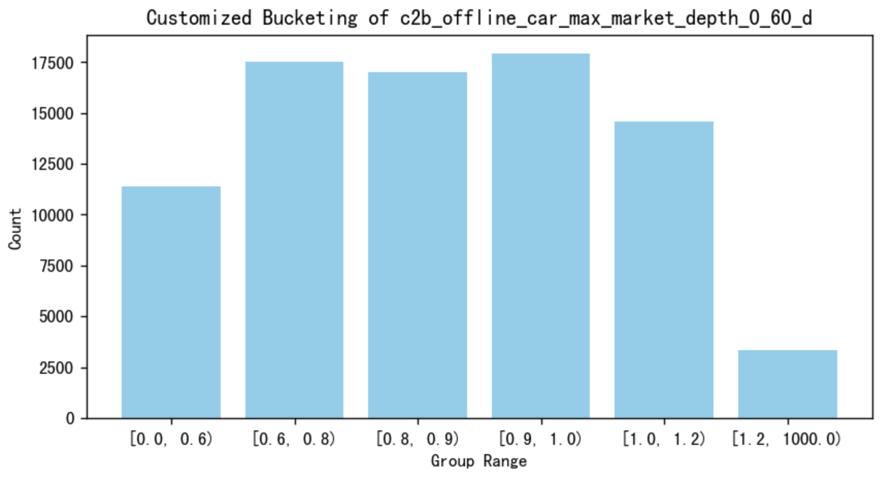
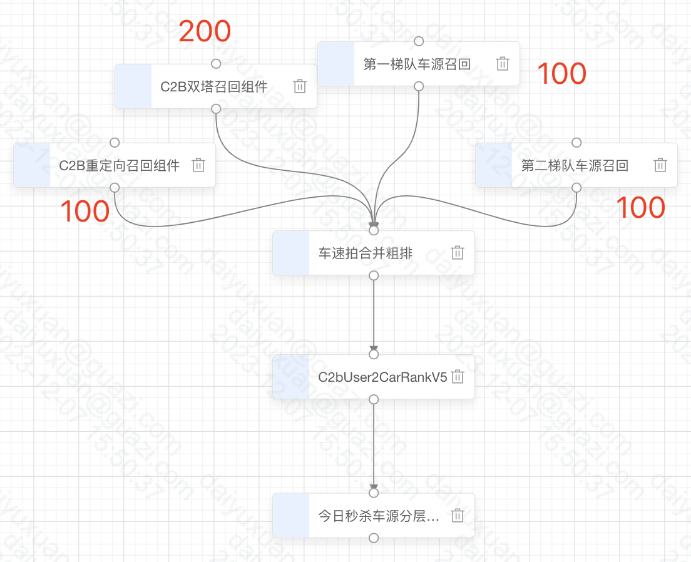
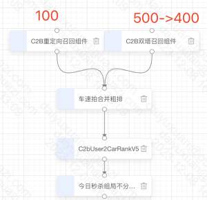

# 【2023-12-07】秒杀场车源召回和加热优化
## 背景
- 目前秒杀场对第一梯度和第二梯度的车源有召回策略，在召回的同时，对秒杀第一梯度有进行加热；存在第一梯度过曝以及其他梯度高转化车源存在曝光不足的情况，期望本期对秒杀场召回和加热策略进行调整，以提高秒杀场车源转化。

## 结论
以下为实验组相对对照组的相对提升，皆显著，于2023-12-25转全
- pv维度：出价pv +9.68%
- 车源维度：出价车源 +13.14%，到心理价80%车源 +7.84%
- 车商车源对维度：出价pair +10.78%
- 出价深度维度：出价pair按出价深度加权 +13.27%
- 下单pv -0.9%(33.2 -> 32.9，不显著，p=0.465)

## 数据概览
表名：g3_feature_dev.c2b_offline_car_bid_uv_max_depth
日期：2023-12-06
取数逻辑：车源出价车商数&最高出价深度
- 车源：
  - guazi_dw_dwb.dwb_ctob_vehicle_auction_car_source_day中t-1在售车源
  - guazi_dw_dwd.dim_com_car_source_ymd中create_time在90天之内

最高出价深度 = 90天内最高出价/(最新市场价，如没有则用模型价)

数量：83855

缺失率：
- 车源出价车商数：0
- 最高出价深度：1.86%，查不到市场价&模型价的车
分布：

 

## 策略规则
_图中任意数字都可配置_

对照组：

实验组：

1212拍场规模阈值更新
- 拍场规模：[0,10):0,[10,40):1,[40,+):2

12-08版配置：

召回：

- 拍场规模：[0,10):0,[10,20):1,[20,+):2
- 拍场质量：[-2,0.5):0,[0.5,0.9):1,[0.9,+):2
- 梯队：[1,2]:0,[3,4]:1
- 001:1.2,011:1.2,021:1.2,121:1.2,000:1.2,010:1.2,020:1.2,120:1.2,101:1.1,111:1.1,201:1.1,211:1.1,221:1.1,110:1.1
